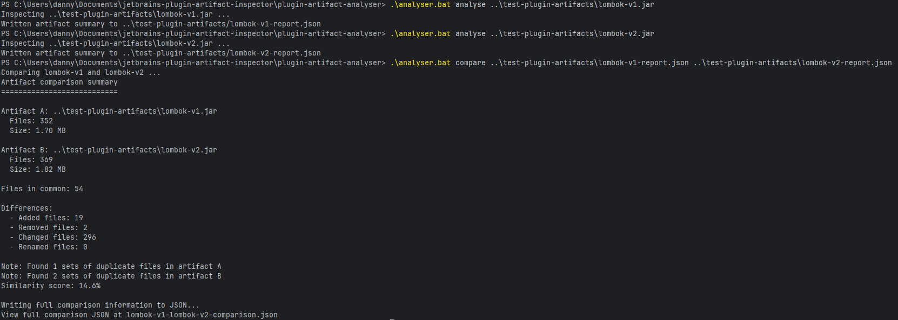

# Jetbrains Plugin Artifact Analyser
A simple CLI tool to analyse and compare JetBrains plugin artifacts (.jar or .zip) to inspect their contents, detect duplicates, and compare versions.

### Features
Analyse a single plugin artifact:
  - Parses each entry in the artifact and stores each entry inside a JSON
  - Works with .jar and .zip plugin artifacts

Compare two plugin artifacts:
  - View the total size and number of files in each plugin
  - Find added, removed, changed and renamed files (assumption is the the two plugins being compared are different versions of the same plugin)
  - Show a simple similarity score to gauge how many files differ between the two versions
  - Performs comparison on two JSON files (the ones resulting from the `analyse` command)
  - Additional flag `-a` can be supplied to `compare` to directly compare two .jar/.zip artifacts in a single command

### Deployment
Follow these command to run the CLI tool - you must have Java installed on your computer:

#### Windows
```
git clone https://github.com/dannykli/jetbrains-plugin-artifact-inspector.git

cd plugin-artifact-analyser

.\analyser.bat compare -a <plugin-artifact-file-v1> <plugin-artifact-file-v2>
```

#### Linux/MacOS
```
git clone https://github.com/dannykli/jetbrains-plugin-artifact-inspector.git

cd plugin-artifact-analyser

.\analyser.sh compare -a <plugin-artifact-file-v1> <plugin-artifact-file-v2>
```

### Usage
```
analyse <artifact.zip|jar>
compare <file1> <file2>

Options for compare:
  -v   Print detailed comparison results (e.g. duplicate files, etc.)
  -a   Compare two plugin artifacts directly (analyse + compare)
```

### Example usage

